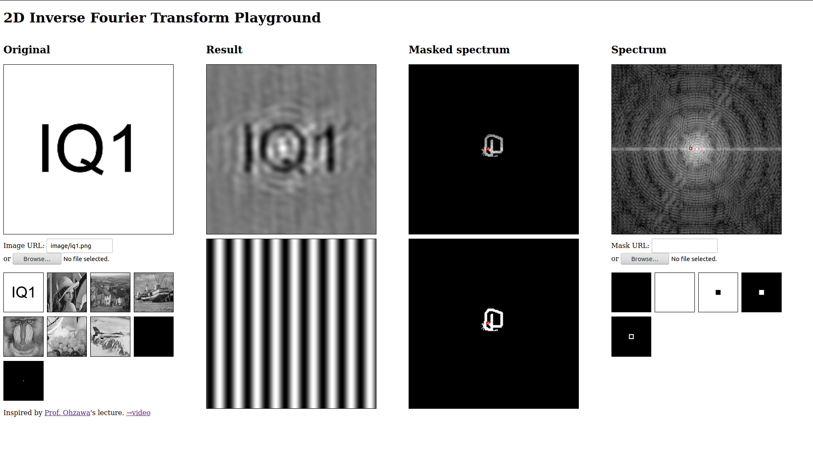

= 2次元高速フーリエ変換をWebGLでがんばる

今年は「link:https://adventar.org/calendars/4115[IQ1 Advent Calendar 2019]」の1まいめにエントリーできました!

今回は2次元フーリエ変換(2DFFT)の話です． +
僕はYouTubeにあるlink:https://www.youtube.com/watch?v=qB0cffZpw-A[2次元逆フーリエ変換でアインシュタインが浮かび上がってくるデモ]が大好きで
「いつか自分でも」と思っていたので，この機会にWebGLを使って実装しました．(めっちゃ楽しかった!)

https://monman53.github.io/demos/2dfft/index.html 2D Inverse Fourier Transform Playground
link:https://github.com/monman53/2dfft/[(source code)]

ほんの少し技術的な補足を書いておこうと思います．

== フーリエ変換

//2次元フーリエ変換は1次元フーリエ変換を縦方向と横方向に施すことで可能です．
//したがって，1次元フーリエ変換ができれば2次元フーリエ変換は簡単です．

次の2次元離散フーリエ変換・逆変換の式を用いました．$N$ は $2$ のべきとします．

[latexmath]
++++
\begin{eqnarray}
F[u, v] &=& \frac{1}{N}\sum^{N-1}_{y=0}\sum^{N-1}_{x=0}f[x, y]e^{-j2\pi(xu+yv)/N},  \\
f[x, y] &=& \frac{1}{N}\sum^{N-1}_{v=0}\sum^{N-1}_{u=0}F[u, v]e^{j2\pi(ux+vy)/N}  \\
\end{eqnarray}
++++

// 2次元フーリエ変換は1次元フーリエ変換を縦方向と横方向に施すことで行うことが多いようです． +
// 今回は少し違う方法を考えてみます．
// 今回は板ポリシェーダ芸で2DFFTを実現しようと思ったので，この式を少し変形したものを元に2DFFTについて考えてみます．

// 1次元の離散フーリエ変換・逆変換の式も一応載せておきます．

// [latexmath]
// ++++
// \begin{eqnarray}
// F[u] &=& \frac{1}{\sqrt{N}}\sum^{N-1}_{x=0}f[x]e^{-j2\pi xu/N},  \\
// f[x] &=& \frac{1}{\sqrt{N}}\sum^{N-1}_{u=0}F[u]e^{ j2\pi ux/N}
// \end{eqnarray}
// ++++

== 高速フーリエ変換

// 高速フーリエ変換では，奇数項と偶数項の2つに式を分けることでうまく動的計画法に持ち込みます．
// 2次元の場合は式を4つに分けられます．
//
// これにより4つの部分問題に分けることができ，それぞれの計算結果が他の変換計算に共有される事実から計算量が削減されます． +
// 1次元高速フーリエ変換のバタフライ演算の図が有名ですが，2次元の場合はこんなかんじでしょうか．
//計算量については，1次元の場合ではlatexmath:[O(N^2)]がlatexmath:[O(N\log N)]に削減されます．

1次元の高速フーリエ変換では，式を偶数項と奇数項に分けて，指数の肩に乗る整数のmodをとるところが肝です． +
2次元の場合でも同様に4つの式に分割することで高速フーリエ変換が実現されます．

[latexmath]
++++
\begin{eqnarray}
F[u, v] &=&                   \frac{1}{N}\sum^{N/2-1}_{y=0}\sum^{N/2-1}_{x=0}f[2x, 2y]    e^{-j2\pi(xu+yv)/(N/2)}  \\
        &+& e^{-j2\pi u/N}    \frac{1}{N}\sum^{N/2-1}_{y=0}\sum^{N/2-1}_{x=0}f[2x+1, 2y]  e^{-j2\pi(xu+yv)/(N/2)}  \\
        &+& e^{-j2\pi v/N}    \frac{1}{N}\sum^{N/2-1}_{y=0}\sum^{N/2-1}_{x=0}f[2x, 2y+1]  e^{-j2\pi(xu+yv)/(N/2)}  \\
        &+& e^{-j2\pi (u+v)/N}\frac{1}{N}\sum^{N/2-1}_{y=0}\sum^{N/2-1}_{x=0}f[2x+1, 2y+1]e^{-j2\pi(xu+yv)/(N/2)}
\end{eqnarray}
++++

逆変換も同様です．

2次元フーリエ変換は1次元フーリエ変換を縦方向と横方向に施す実装方法がありますが，
せっかくなので今回はこの式をそのまま使った実装をしてみました．

== 実装(適当)

1次元の高速フーリエ変換の場合，
バラフライ演算の図の1点を計算するのに2点の値を参照します． +
2次元の場合は先程の式からわかるように4点の値を参照することになります． 

テクスチャを2枚用意し，テクスチャ4点をサンプリングして計算するFFT用シェーダでテクスチャレンダリングをします． +
そして2枚のテクスチャをswapしながらこれを $\log(N)$ 回繰り返します． +

そのほかUI用に別の複数のテクスチャやシェーダが使われています． +
マウスのイベントに反応して，その都度テクスチャレンダリングのパイプラインシステムが動作します．

// バタフライ演算の1ステップをテクスチャレンダリングで実現します． +
// 2枚のテクスチャを交互に使って計算していきます． +
// 例えば256x256の画像であれば8ステップのレンダリングで計算が終了します．
//
// FFTの計算以外にもUI用のCanvasをいくつか設置し，
// それぞれをつなぐテクスチャのパイプラインシステムを作るわけなのですが，
// WebGLでは複数のRenderer間でテクスチャを共有できない
// footnote:[Allow access to the same WebGLRenderer texture across multiple WebGLRenderer instances https://github.com/mrdoob/three.js/issues/13745]
// ので，Renderer一本でがんばる必要がありました．
//
// あと，デフォルトでテクスチャのサンプリング方式がLinnerだったので計算が破綻しました． +
// Nearestに変更する必要があります．(いまいちこのあたりよく分かっていない．)

== ひとこと

修論とは...

明日はcrskさんが何か添えてくれるみたいですね!

link:https://adventar.org/calendars/4115[IQ1 Advent Calendar 2019]
